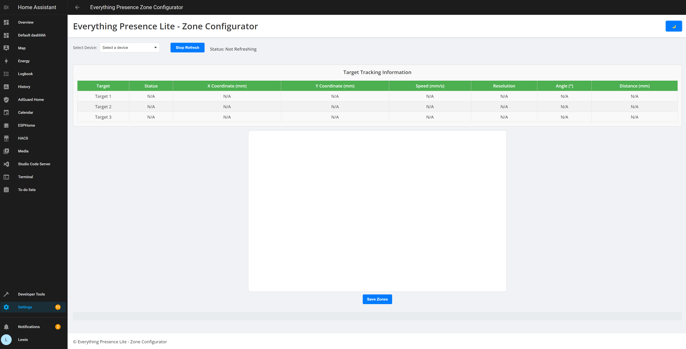
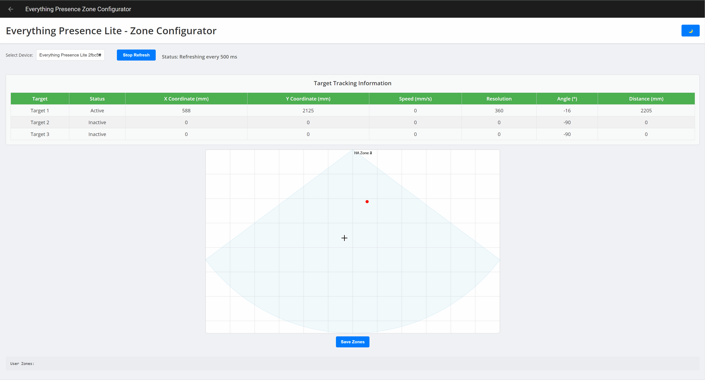
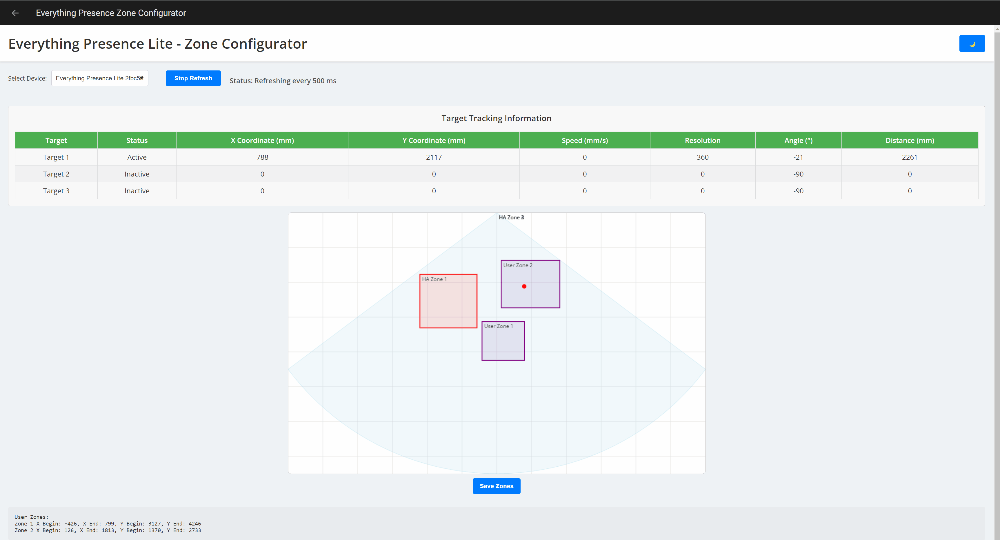
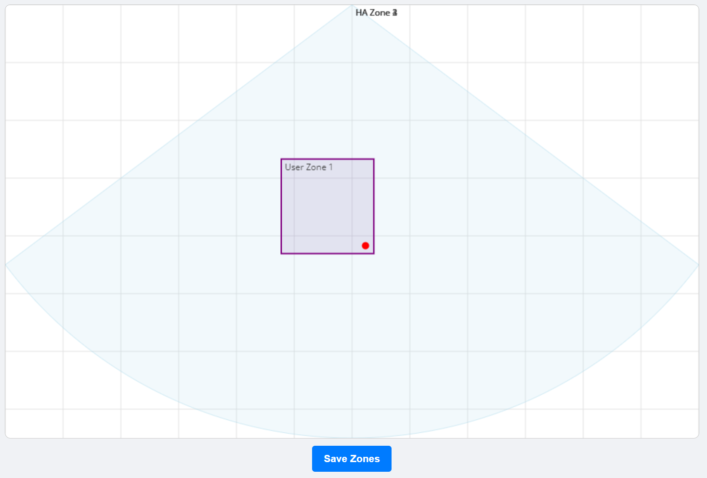

# Creating Zones within Home Assistant

{: .no_toc }

Zones.
{: .fs-6 .fw-300 }

## Home Assistant Entities

Everything Presence Lite supports zones, which let you track where specifically in a room or space a target is. Want to run an automation when someone sits on the sofa in the Living Room, but a different one when they walk through to the Kitchen? Zones can help you do that!

### Installing the Add-on

Everything Presence Lite has a visual tool which can help you to create zones easily, showing real-time tracking information. It is's available as an add-on, click the button below to add the repository to Home Assistant:

[](https://my.home-assistant.io/redirect/supervisor_add_addon_repository/?repository_url=https://github.com/EverythingSmartHome/everything-presence-addons)

Or alternatively, add the following URL manually as a repository to the add-on store: https://github.com/EverythingSmartHome/everything-presence-addons

Once the repository has been added, refresh the page and find the Everything Presence Zone Configurator add-on:


Select the add-on, then hit install. Once installed, hit start and then "Open Web UI". This will open up the Zone Configurator Dashboard:



### (Advanced) Alternative install with docker (no Supervisor)

Use docker run or docker compose similar to following examples, dont forget to adjust HA URL and use a generated access token

*docker run basic example:*
```
docker run -d -e HA_URL=http://HA_URL:8123 -e HA_TOKEN=LONG_LIVE_TOKEN -p 8099:8099 --name everything-presence-mmwave-configurator everythingsmarthome/everything-presence-mmwave-configurator:latest 
```

*docker compose basic example:*
```
services:
  zones:
    ports:
      - 8099:8099
    image: everythingsmarthome/everything-presence-mmwave-configurator:latest
    container_name: everything-presence-mmwave-configurator
    environment:
      - HA_URL=http://10.0.1.11:8123
      - HA_TOKEN=123-generate-token-at-url:8123/profile/security-456
```

### Using the Add-on

From the top left, use the dropdown to select a device. This will load up the real-time tracking information from the Everything Presence Lite:


To explain the elements:
* The target tracking information box displays the current tracking information of target 1-3, providing the X and Y coordinate, speed, angle and distance.
* The visual radar box displays several elements:
* * This is a top down view.
* * The perspective of the Lite is at the top in the center of the box, pointing down.
* * If you have a zone configured inside of Home Assistant, it will show up as a coloured box
* * Each red dot represents a tracking target which moves around as a target moves.
* * Each grid line is 1m in length/width, which is helpful when measuring or creating zones.
* The Stop Refresh button will stop data live updating, useful for taking a note of coordinates/zone information.
* The user zones box at the bottom will display the coordinates for user drawn zones, incase you manually want to enter the information.

### Creating a Zone

Let's create our first zone!

This tool can automatically draw zones for you, simply click on the radar map and drag out a rectangle to create a zone. If you want to refine the position, hover over the created zone and drag it around.



You can create up to 4 zones within the tool (the max the Lite currently supports), with each zone being represented by a different number. You do not need to create all 4 zones if you only need or want 1 zone, only create the zones you need.

To save the zones to the Lite and to Home Assistant, hit the save zones button, which will confirm the zones were saved:



Nice, zones are created! But..

How do you actually create a zone that works for your space? Good question!

The best way I've personally found so far (and I've got some ideas how to improve this in the future), is to physically use your body to mark the zone by walking around, then simply draw it. Previously you would do this and take a note of all 4 corners of a zone, but since this tool now draws it for you, you only really need to do 2 corners.

First, start by making sure there are no other targets moving in the space except from you, otherwise it could be tricky to accurately map.

Next, look at the space you want to zone. I highly recommend standing at the opposite side of the room facing the sensor, then look at the top left corner of the zone, again from the perspective of facing the sensor. (Hopefully this doesn't add confusion, but from the perspective of the sensor, this would be the nearest and most right point to the sensor).

To help picture this, let's say I want to create a zone over my sofa, we are going to start with corner 1 first, then corner 2:


To start, simply walk to that corner of the zone, and hit the stop refresh button at the top. Then create a small zone over the target dot. It doesn't matter how big for now, we will adjust it later:


Once corner 1 is marked, then hit the start refresh button to resume tracking. Then walk to the opposite corner of the zone (which will be the bottom right corner when facing the sensor), and hit the stop tracking button again.


Then simply drag the corner of the zone out to cover the second tracking point. 



And that's it! Repeat for any other zones you want to create and hit save. Please note, when you save a zone, any others you don't create will be cleared in it's current version. Please see the Savings Zones section below.

I know that may seem complicated, but once you create one or two and understand the rules, it's pretty quick to do and you don't really need to touch them once created.

### Deleting Zones

To delete a user defined zone (one you have drawn but not actually saved to Home Assistant yet), simply right click on it and hit OK on the popup to delete.

### Saving Zones

The way the configurator currently works is that it will only let you configure zones sequentially. This means that for example, lets say you have 2 zones configured and you want to add a 3rd zone. If you draw out a single zone, it will replace zone 1 AND also delete zone 2 (any zones you don't draw will be set to 0). To retain zones 1 and 2, and add zone 3, simply draw out zones 1 and 2 first, before adding 3.


<script>
const toggleDarkMode = document.querySelector('.js-toggle-dark-mode');

jtd.addEvent(toggleDarkMode, 'click', function(){
  if (jtd.getTheme() === 'dark') {
    jtd.setTheme('light');
    toggleDarkMode.textContent = 'Preview dark color scheme';
  } else {
    jtd.setTheme('dark');
    toggleDarkMode.textContent = 'Return to the light side';
  }
});
</script>
