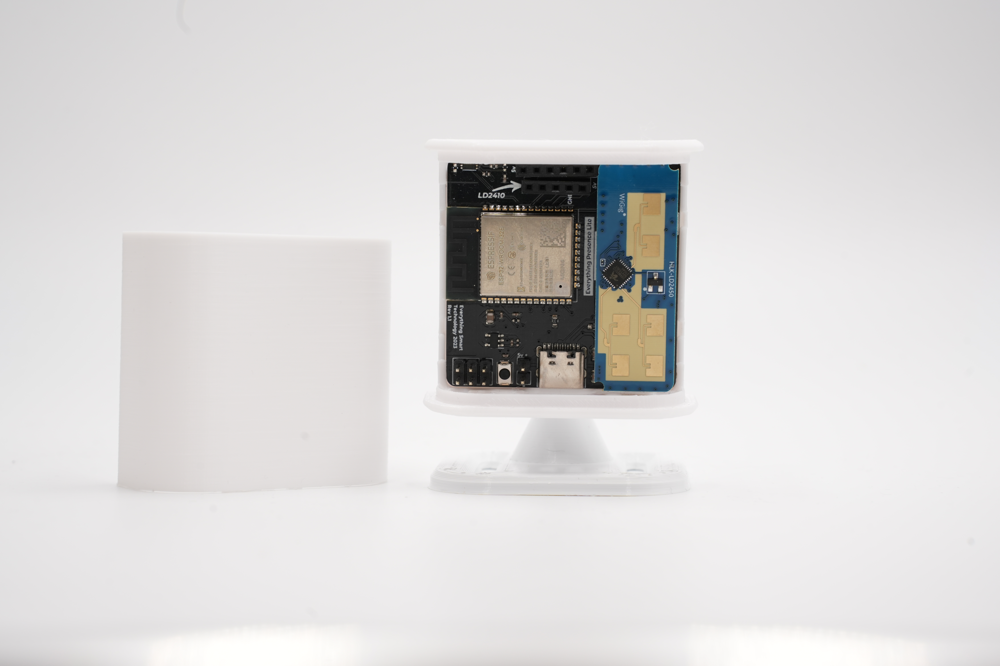

Welcome to the documentation for the Everything Presence Lite!

This documentation will guide you through the hardware, setup and installation of the Everything Presence Lite for use with Home Assistant. Each section will be broken out into their own pages, and at the bottom of each page you will find a link to the next step.

Let's get started with the hardware unboxing and preperation first!

[Hardware Overview](./hardware-overview.html){: .btn .btn-blue }
