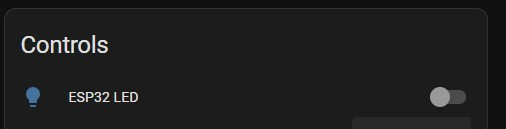

# Home Assistant Entities Explained

{: .no_toc }

What are all of these entities!?
{: .fs-6 .fw-300 }

## Home Assistant Entities

After adding the Lite to Home Assistant, you may wonder which sensors you can use and what they do.

To view all of the sensors and entities, click on the device from the ESPHome menu:

This will show you a dashboard of all of the sensors and controls inside of Home Assistant that you can use in your Automations:

### Illuminance

Illuminance is measured from the on-board light sensor in lux. There are slots at the top of the Lite case that allow for light to pass-through and be measured, so make sure not to obstruct these for the best readings.

Illuminance supports a configurable offset using the UI which allows you to offset the reported value on the fly to calibrate each of these sensors for your environment. You can do that with these highlighted control under the configuration section:

### Occupancy

You will find a sensor called Occupancy - this sensor indicates if movement is detected anywhere within the sensors field of view (as long as the movement occurs within the max distance setting described below). The mmWave sensor has a configurable offset for the "Blind time" or "Occupancy delay" which we will cover below. The default blind time is 15 seconds, which is basically how long the sensor takes to go to an "Off" or "clear" state after motion has stopped being detected:

### Offsets for mmWave

The mmWave sensor has an adjustable timeout period inside of Home Assistant using the Occupancy Off Delay control. The value is measured in seconds and the default is for 15 seconds. I generally wouldn't recommend setting this below 15s to help with false clearing.

If you experience issues with the sensor going to clear when sitting still, you can increase the off delay to 60-120s to help with this.

### Distance

The mmWave sensor has a configurable distance control inside of Home Assistant.

Distance allows you to adjust the max range of the sensor, up to a maximum of 6m. Please note that 6m is the max range, but doesn't nessecarily mean the sensor is capable of detecting the tiniest of movements at 6m - placement is still important for the best results - see the [tuning guide](../tuning.html) for more information:

### Installation Angle

If you find that the best placement for the Everything Presence Lite is not parallel to a wall, you can set the installation angle. This will allow the placement in corners, keeping the zones aligned with the walls of the division.

### Zones

The Everything Presence Lite also supports zones, which allow you to define a space in a room that when a target (person) walks into, the sensor can detect that and let you run automations based on which zone a person is in. The Everything Presence Lite supports up to 4 individual zones.

Zones are created by setting measurements in 4 entities - Zone X Begin, Zone Y Begin, Zone X End and Zone Y End:

 Zone 1 is enabled by default. If you would like to enable zones 2, 3 and 4, simply click on the entities not shown message:

To reveal entities that are disabled by default:

Click the entity you want to enable, then click the settings icon in the right hand corner of the popup. Then enable the entity:

Wait 30 seconds, refresh the page and the entity is now enabled. Repeat this for each entity, making sure to do all 5 entities to activate a single zone.

### Targets

Along with zones, the Everything Presence Lite supports targets. A target a source of movement that the sensor detects, usually a person. The sensor can provide information about the target, such as the X and Y coordinate (which the sensor uses to detect if a target is within a zone), the distance the target is from the sensor, the angle relative to the sensor, the speed the target is moving at and if the target is active or not:

The Everything Presence Lite can track upto 3 targets at one time.

### Turning off LEDs

The Lite has an LED on the PCB that can be controlled:

