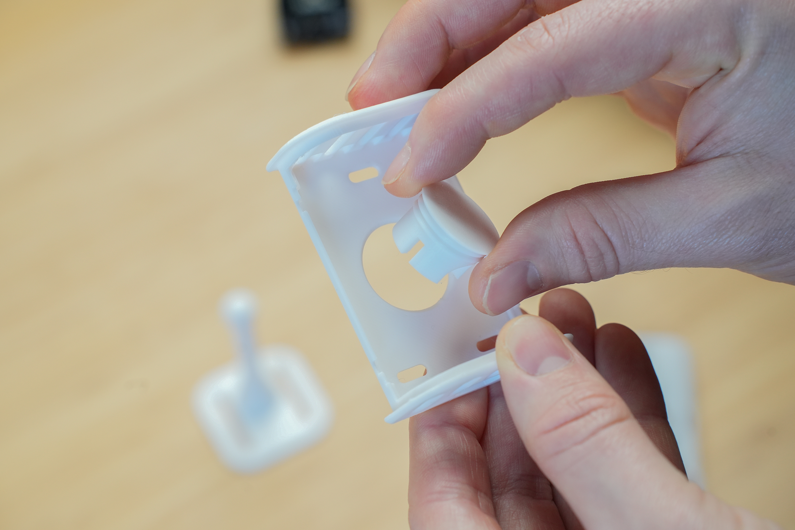
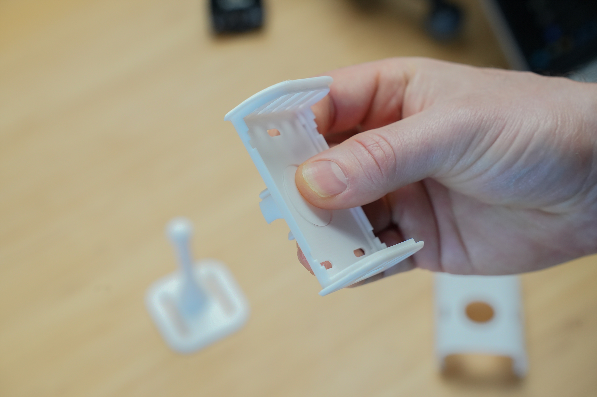
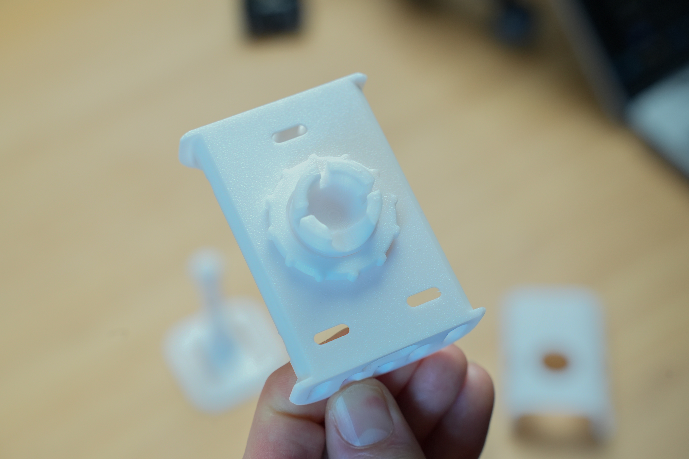
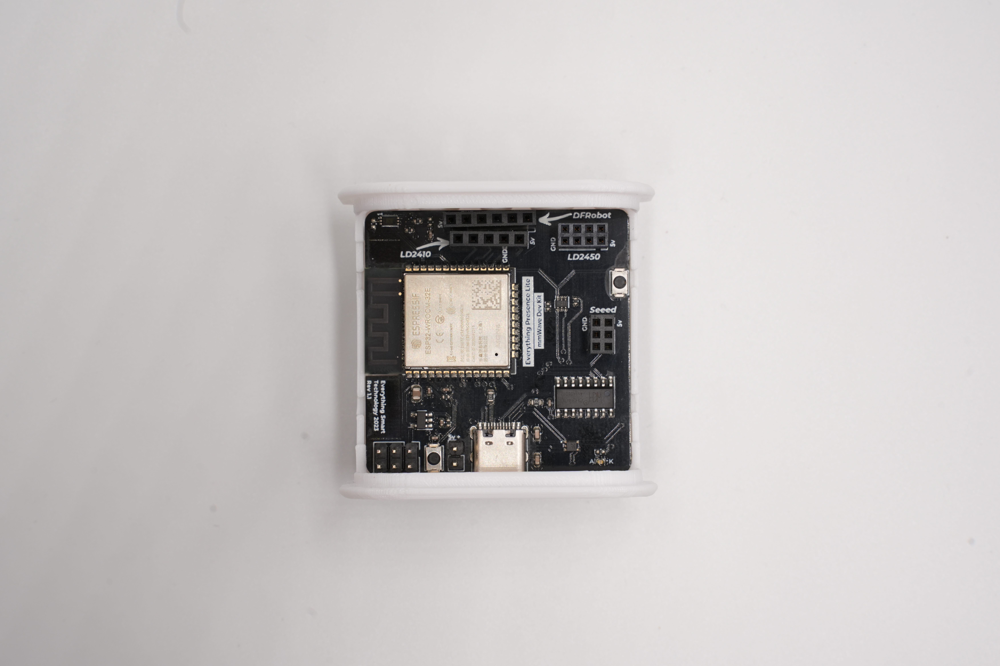
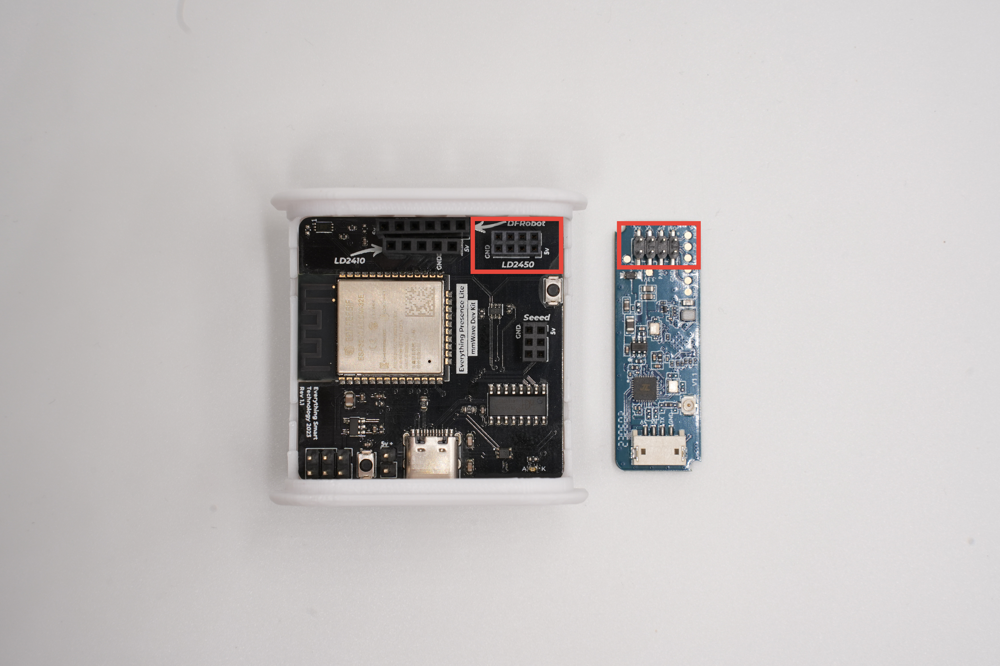
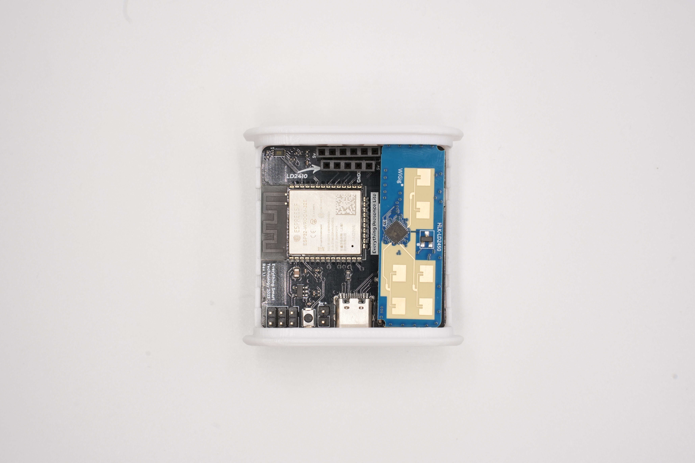
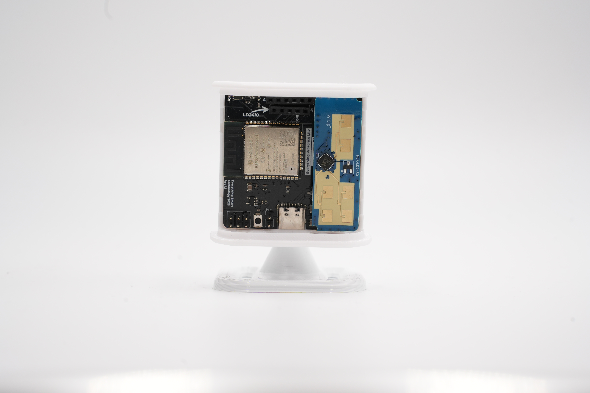

# Assembly

{: .no_toc }

Time to assemble the hardware ready for setup!
{: .fs-6 .fw-300 }

{: .important }
If you have the fully assembled Everything Presence Lite with the injection moulded case, you can skip ahead to the [connecting to WiFi section](./updating.html)

## Case - Part 1

First you are going to want to grab 4 components of the case - the back, ball joint, locking ring and stand.

Insert the ball joint through the back of the case from the front side. Then, while holding the ball joint in place, use the locking ring to tighten in place.

{: .important }
The locking ring has a slight groove on one side - make sure the groove faces the back of the case.

{: .note }
The ball joint will be pretty tight but will still rotate with enough force - this is intentional to allow you to orientate in any position.

## Board and Sensors

Grab the Lite board and the mmWave sensor.

The the Lite board and press it into the back of the case - each corner should click into place.

Next, take the mmWave sensor and insert it into the slot that is labeled LD2450 in the top right hand corner, make sure the pins are aligned correctly with the socket and not shifted one position left or right.

{: .warning }
Making sure to line up the 5v pin on the sensor with the 5v pin on the board.

{: .warning }
Please take extra care with the mmWave sensor when it's inserted into the slot since the pins will bend easily and could cause damage. Remove the sensor whenever moving or working on it.

## Case - Part 2

Next, clip the front of the case on and into position.

And finally, use your thumb to press against the back of the ball joint for support and then push the stand onto the ball joint.

{: .note }
The stand may be quite tight initially due to the 3D printing process, but should loosen up after a few rotations.

The final hardware will look like this (cover removed for clarity):

We can now power on for the first time.
{: .fs-6 .fw-300 }

## Powering On

You will want to grab the included right angle USB-C cable from the box, and a spare power brick - any charger should suffice, as power requirements are around 200 milliamps.

The power brick will be used later when moving the Lite to it's final position, but for now take the other end of the USB cable and plug it into a laptop or desktop.

## Next Steps

Now we have assembled the hardware, we can update it and connect it to WiFi!

[Updating and connecting to WiFi](./updating.html){: .btn .btn-blue }

