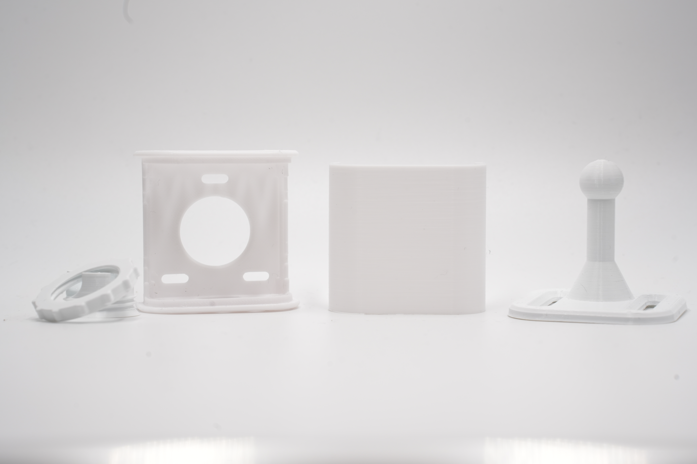
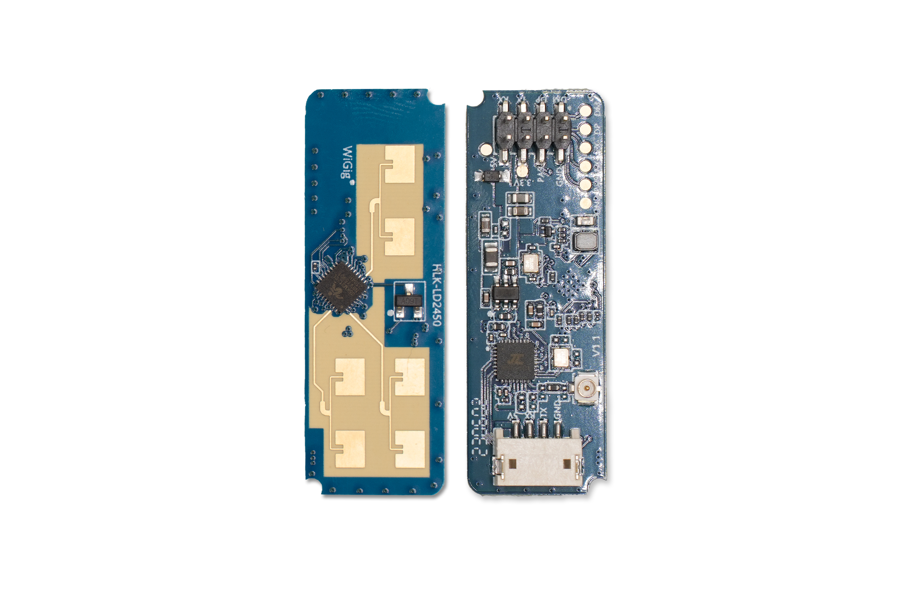

# Hardware Overview

{: .no_toc }

Let's take a look at an overview of the hardware and parts required for setup.
{: .fs-6 .fw-300 }

{: .important }
If you have the fully assembled Everything Presence Lite with the injection moulded case, you can skip ahead to the [connecting to WiFi section](./updating.html)

There are several components that make up the Everything Presence Lite. You may have received some or all of these components depending which version you purchased - if you purchased the board only then you will need to provide your own compatible mmWave Sensor.

Each component is listed below - please familiarise yourself with each component for this guide.

Here is an overview of everything in the box:

## Everything Presence Lite Board

The Lite board is the main PCB for the device. It's where the ESP32 is located that provides Wi-Fi connectivity and is the brains of all of the sensors.

Each of the main components is labelled directly on the board itself to help with assembly. Directly on the Lite board we have the following components:
* ESP32-WROOM-32E - 4MB flash version
* BH1750 Light Illuminance sensor
* Header Slot for DFRobot SEN0395 mmWave Sensor
* Header Slot for HiLink LD2450 mmWave Sensor
* Header Slot for HiLink LD2410C mmWave Sensor
* Header Slot for various Seeed mmWave Sensors
* USB-C for power and programming
* 5v Header input for optional power
* 4 Additional GPIO pins for expansion

## Official Case

The case for the EPL is currently shipped in the box. If you prefer to print your own, in a different colour the STL is located on Printables (link pending!)

The case has 5 components - Front, Back, Stand, Ball Joint and Locking Ring.

## mmWave Sensor

The Lite is compatible with various different mmWave sensors on the market, making it the perfect board to develop and test mmWave applications with, however to get you started, we include the LD2450 sensor in the box and is what we will use for this guide. The LD2450 is a mmWave sensor from HiLink that supports up to 3 targets to track in 2D space.

The Lite is compatible with quite a few different mmWave Sensors - check the list for details.

## Next Steps

Now we have familiarised ourselves with the hardware, let's get the hardware assembled and ready to setup!

[Assembly](./assembly.html){: .btn .btn-blue }

