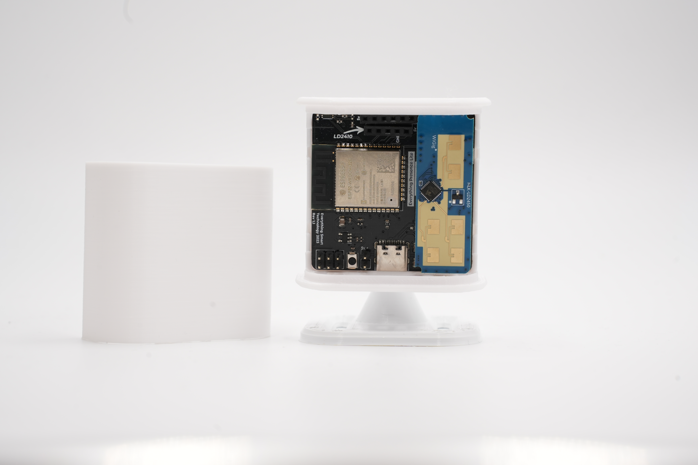

Welcome to the documentation for the Everything Presence Lite!

This documentation will guide you through the hardware, setup and installation of the Everything Presence Lite for use with Home Assistant. Each section will be broken out into their own pages, and at the bottom of each page you will find a link to the next step.

## Let's Get Started!

If you have the Everything Presence Lite Kit (not assembled) with the 3D printed case, [jump into the assembly process first](./hardware-overview.html).

If your Everything Presence Lite came fully assembled out of the box with the new injection moulded case, you can [skip ahead and get the Lite connected to WiFi](./updating.html)!
