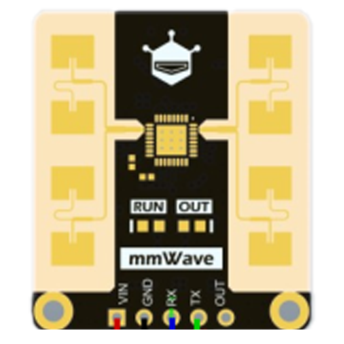

# Updating and Connecting To WiFi

{: .no_toc }

This page will help you to flash and update your Everything Presence Lite to the latest version and get it connected to WiFi!
{: .fs-6 .fw-300 }

## Automatic Setup

If you have the new Everything Presence Lite that comes fully assembled with the injection moulded case, your device comes pre-installed from the factory ready to go. You can benefit from automatic setup in Home Assistant, if your Home Assistant server has [bluetooth enabled](https://www.home-assistant.io/integrations/bluetooth/).

If you have Bluetooth enabled, as soon as you power the Everything Presence Lite, Home Assistant should automagically discover it on the Device page:

Follow the prompts, entering your WiFi details to get the Lite connected to your home network.

## Next Steps

Once connected to WiFi, you are ready to connect to Home Assistant.

[Connecting to Home Assistant](./Home%20Assistant/connecting-home-assistant.html){: .btn .btn-blue }

## Manual Setup and Factory Resetting

The steps below are for the following users:

- You have the Everything Presence Lite Kit with the 3D printed case
- You don't have Bluetooth enabled in Home Assistant and can't do the automatic setup above
- You want to factory reset the firmware and start again

This process below will guide you through installing the latest firmware on your device, and get you connected to WiFi.

Here you can install the latest firmware on the Everything Presence Lite board for direct integration with [Home Assistant](https://home-assistant.io)

First, make sure you have the Lite connected to a USB port on your computer and select the platform you would like to install below. Hit the connect button, select the USB port from the list and then hit the install button to begin installing the latest software on your Everything Presence Lite.

Once the install has completed, you can then connect the Lite to your WiFi easily and securely.

{: .warning-title }
If you do not see a "Connect" button below, use a supported web browser like Google Chrome.

{: .warning-title }
After clicking the "Connect" button, if you do not see a "USB Serial" port listed, or you get the error "Failed to open serial port.", you may need to install the CH340 driver. The installer should give you links to the latest driver.

    
Select Smart Home Platform:

    

        <label>
            <input type="radio" name="platform" value="Home Assistant" />
            

                
                

                    
Home Assistant

                    
Choose this for Home Assistant integration, with additional options for Bluetooth Proxy

                

            

        </label>
    

    

        
Select Sensor:

        

            <label>
                <input type="radio" name="sensor" value="LD2450" />
                

                    
                    

                        
LD2450

                        
The HiLink LD2450 supports 6m range, tracking of 3 targets and zones. This is the sensor that ships with the Everything Presence Lite sensor.

                        <a href="https://s.click.aliexpress.com/e/_DBh0oMt" target="_blank" rel="noopener noreferrer" class="purchase-link">Buy</a>
                    

                

            </label>
            
Additional Sensors

            

                <label>
                    <input type="radio" name="sensor" value="DFRobot SEN0395" />
                    

                        
                        

                            
DFRobot SEN0395

                            
The DFRobot SEN0395 has an 8m range, configurable distance, sensitivity and latency. It is extremely reliable for static presence detection and used in the <a href="https://shop.everythingsmart.io/products/everything-presence-one-kit" target="_blank" rel="noopener noreferrer">Everything Presence One</a>.

                            <a href="https://www.dfrobot.com/product-2282.html?tracking=NKIPMR1X7YgIqIre4Lzs1ENvaBRhjQN1dac0FK9LO21raHxHPg5XMXWQ4pdTxdlH" target="_blank" rel="noopener noreferrer" class="purchase-link">Buy</a>
                        

                    

                </label>
                <label>
                    <input type="radio" name="sensor" value="SEN0609" />
                    

                        
                        

                            
SEN0609

                            
The new DFRobot SEN0609 has a 25m range, 2 configurable sensitivity levels and is extremely reliable at static presence. Select this option if you are using the DFRobot SEN0609 sensor (5 Pin).

                            <a href="https://www.dfrobot.com/product-2793.html?tracking=NKIPMR1X7YgIqIre4Lzs1ENvaBRhjQN1dac0FK9LO21raHxHPg5XMXWQ4pdTxdlH" target="_blank" rel="noopener noreferrer" class="purchase-link">Buy</a>
                        

                    

                </label>
                <label>
                    <input type="radio" name="sensor" value="LD2410C" />
                    

                        
                        

                            
LD2410C

                            
The HiLink LD2410 has a 6m range, supports configurable distance, sensitivity and a single target tracking for a very affordable price.

                            <a href="https://s.click.aliexpress.com/e/_DmNyqWH" target="_blank" rel="noopener noreferrer" class="purchase-link">Buy</a>
                        

                    

                </label>
                <label>
                    <input type="radio" name="sensor" value="Seeed 24Ghz Lite" />
                    

                        
                        

                            
Seeed 24Ghz Lite

                            
The Seeed 24Ghz Lite has a 5m range, supports configurable distance, sensitivity and a single target tracking for a very affordable price.

                            <a href="https://www.seeedstudio.com/24GHz-mmWave-Sensor-Human-Static-Presence-Module-Lite-p-5524.html?sensecap_affiliate=TcBAarc&referring_service=link" target="_blank" rel="noopener noreferrer" class="purchase-link">Buy</a>
                        

                    

                </label>
            

        

    

    

        
Select Module:

        

            <label>
                <input type="radio" name="module" value="No Module" />
                

                    
No Module

                    
No additional module installed.

                

            </label>
            <label>
                <input type="radio" name="module" value="CO2 Module" />
                

                        
CO2 Module

                        
Add support for the <a href="https://shop.everythingsmart.io/products/everything-presence-one-lite-co2-add-on">optional CO2 module</a>.

                

            </label>
        

    

    

        
Select firmware:

        

            <label>
                <input type="radio" name="haOption" value="Bluetooth" />
                

                    
Bluetooth Proxy

                    
Choose this option to enable Bluetooth Proxy and Improv. Can cause connectivity issues with WiFi.

                

            </label>
            <label>
                <input type="radio" name="haOption" value="No-Bluetooth" />
                

                    
No Bluetooth

                    
Choose this option to disable Bluetooth Proxy and Improv, which can improve stability of the WiFi connection and/or you don't need Bluetooth Proxy.

                

            </label>
        

    

    

        <h3>You are flashing:</h3>
        

        

        

        

    

    <esp-web-install-button class="hidden"></esp-web-install-button>

## Next Steps

With the Lite fully updated and connected to WiFi, the final step is to connect it to Home Assistant.

[Connecting to Home Assistant](./Home%20Assistant/connecting-home-assistant.html){: .btn .btn-blue }

